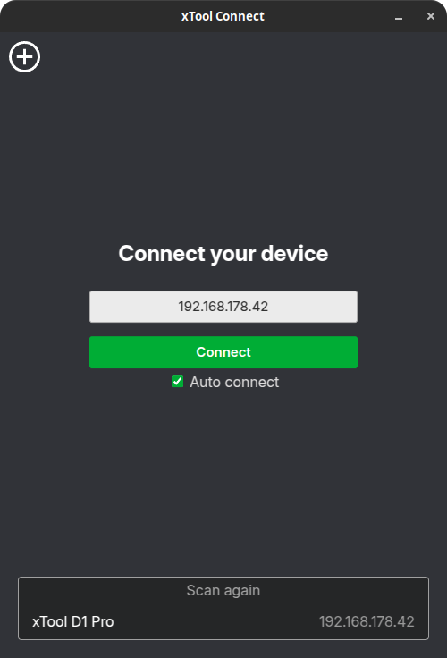
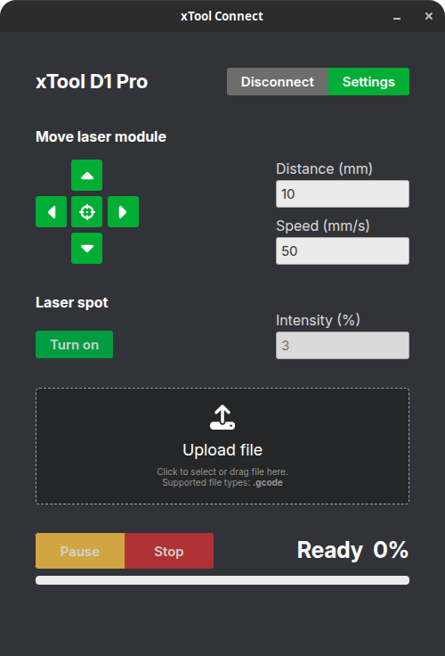
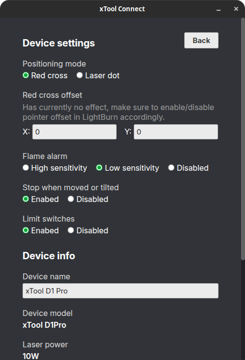
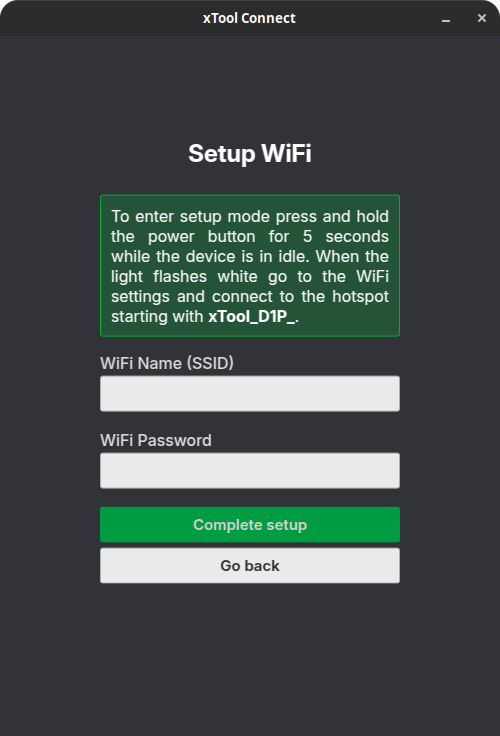

# xTool Connect
A community project designed to enable WiFi connectivity for the xTool D1 Pro and possibly other xTool devices like the D1, with LightBurn and other third-party design software.

    
    
    
    

## Install & Usage
You can download the Windows and Linux versions from [Releases](https://github.com/1RandomDev/xTool-Connect/releases). \
After installation, your laser is automatically discovered and you can connect to it. The app now lets you modify device settings, move the laser head and control the current print job.

## Upload using LightBurn
Since LightBurn does not support external device plugins right now, this project emulates a generic GRBL laser connected via Serial over TCP. Because of this, certain LightBurn features like Pause, Stop and some advanced controls are currently unsupported. For those functions, use the buttons within the app.\
When using xTool Connect, different start and end GCodes then the ones from the official template are required, therefor it's recommended importing the provided [Template File](xTool-D1-Pro.lbdev).\
\
To upload programs, you can either use the standard "Start" button (slow for more complex programs) or manually save and upload the GCode. Additionally there's a watched file that automatically triggers an upload when overwritten, located at `%AppData%\xTool-Connect\upload.gcode` (Windows) or `~/.local/share/xTool-Connect/upload.gcode` (Linux). Select "Save GCode", navigate to the file for your OS and click overwrite (path will be remembered for the next time).

## Currently Tested Models
- xTool D1 Pro

Don't have any other :C

## xTool API Documentation
In [XTOOL_PROTOCOL](XTOOL_PROTOCOL.md) you can find an almost complete documentation of the xTool D1 Pro HTTP and Websocket API that I reverse engineered from the official app and a binary analysis of the firmware update file.
